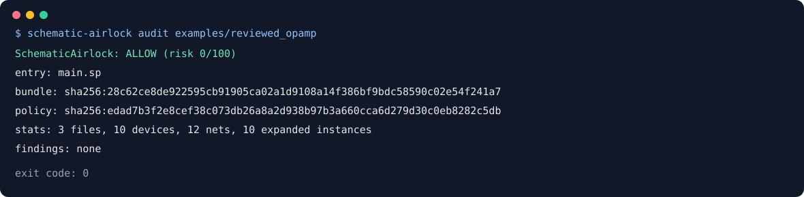

# SchematicAirlock

[](https://github.com/appleweiping/SchematicAirlock/actions/workflows/ci.yml)
[](https://github.com/appleweiping/SchematicAirlock/actions/workflows/codeql.yml)
[](https://www.python.org/)
[](LICENSE)

SchematicAirlock is a deterministic, offline safety gate for SPICE artifacts
produced by people or generative tools. It opens only files inside an explicit
bundle, parses a bounded language subset without invoking a simulator, builds a
scoped connectivity graph, and returns `allow`, `review`, or `deny` with stable
finding identifiers and concrete remediation.

It is designed for a pre-simulation CI boundary. An `allow` result means that
the artifact passed the configured static checks; it is not a claim that the
circuit is correct, manufacturable, stable, or safe to fabricate.



## Why an airlock

A generated netlist is executable input to many simulators. It can reference
ambient files, request enormous analyses, load extensions, or encode a circuit
whose obvious electrical invariants are broken. SchematicAirlock treats the
artifact as untrusted data and makes the acceptance decision reproducible.

The audit never runs a simulator, shell, model compiler, or subprocess. It does
not access the network or expand environment variables. Includes must resolve
to regular UTF-8 files within the submitted directory.

## Installation

Python 3.11 or newer is required. The runtime has no third-party dependencies.

```console
python -m pip install .
schematic-airlock --help
```

For development:

```console
python -m pip install -e ".[dev]"
ruff check .
ruff format --check .
pytest
python -m build
```

## First audit

Audit a single netlist:

```console
schematic-airlock audit design.sp
```

Audit a directory with a manifest and emit deterministic JSON:

```console
schematic-airlock audit examples/reviewed_opamp --format json --pretty
```

The default `--fail-on review` exits with code 2 for both `review` and `deny`.
Use `--fail-on deny` when review findings should remain CI-successful:

```console
schematic-airlock audit design.sp --fail-on deny
```

Exit codes are stable:

| Code | Meaning |
| ---: | --- |
| 0 | Decision is below the chosen failure threshold |
| 2 | Audit completed and the gate threshold was reached |
| 3 | The input, policy, report, or filesystem operation was invalid |

## DC voltage-envelope checking

`voltage-check` adds exact rational voltage-difference reasoning over literal DC
sources, zero-ohm ties and explicit operating envelopes. It checks all six MOS
terminal pairs and diode forward/reverse ranges using user-supplied model ratings,
retaining `indeterminate`, `possible-violation` and contradictory-source outcomes.

```console
schematic-airlock voltage-check examples/voltage_envelope/design.sp --rules examples/voltage_envelope/rules.json
```

The example deliberately exposes a possible PMOS body-diode violation under its
independent envelopes; it is not a foundry-certified inverter. See
[voltage assumptions, bounds, algorithms and limitations](docs/voltage-envelopes.md).

## Exact linear DC operating points

For a literal resistor and independent DC-source network, `linear-dc` computes
exact node voltages, branch currents and absorbed power, independently checks
physical residuals and distinguishes inconsistent, singular and unassessed
inputs. See the [linear DC contract](docs/linear-dc.md). This remains separate
from artifact acceptance and nonlinear voltage-rating checks.

## Offline DRC, LVS, and PEX lineage


SchematicAirlock can also gate physical-verification evidence that another workflow has already
produced. It does not run Magic, KLayout, Netgen, a simulator, or any subprocess. A strict
`verification.json` binds schematic, layout, and extracted views to Magic DRC, KLayout DRC,
Netgen LVS, and Magic PEX reports; the output records the observed SHA-256 of every report and
every lineage input/output.

```console
schematic-airlock verification-check tests/fixtures/verification_bundle
schematic-airlock verification-check artifact/verification.json --format json --pretty
```

Report files are no-clobber by default. `--force` permits an intentional replacement, but an
output path can never alias an audited netlist, policy, verification manifest, artifact, or tool
report. File output is installed atomically after the complete gate succeeds.

The completeness gate requires layout DRC, schematic-to-layout LVS, and layout-to-PEX evidence.
Findings use one versioned shape: `severity`, `rule`, `message`, `source`, `tool`, `location`, and
`objects`. Exact waivers retain the original finding, expire against the manifest's explicit
assessment date, and cannot waive missing lineage. Duplicate IDs or paths, path traversal,
symlink escapes, non-finite coordinates, oversized input, contradictory terminal results, and
ambiguous waiver matches are rejected.

See [the physical-verification lineage contract](docs/verification-lineage.md), the
[manifest schema](docs/schemas/verification-manifest-v1.schema.json), and the
[report schema](docs/schemas/verification-report-v1.schema.json). The included reports and
artifacts are original synthetic fixtures, not copied EDA output or foundry decks.

## Bundle contract

A bundle is either one netlist file or a directory. A directory may contain a
strict `manifest.json`:

```json
{
  "schema_version": 1,
  "entry": "main.sp",
  "description": "Two-stage demonstration amplifier",
  "intended_ports": {
    "vin": "input",
    "vout": "output",
    "vdd": "supply",
    "0": "ground"
  }
}
```

Supported port roles are `input`, `output`, `inout`, `supply`, `ground`, and
`bias`. `schema_version` is required and unknown manifest fields are rejected. Without a manifest, pass
`--entry`, or place exactly one recognized top-level netlist in the directory.

Relative `.include` and file-style `.lib` references are followed. Absolute
paths, URL-like targets, root escapes, broken references, non-UTF-8 text, NUL
bytes, symlink escapes, and read-budget overruns become input errors or denied
findings. Only files actually read participate in the bundle fingerprint.

## Checks

SchematicAirlock reports findings in these families:

- include confinement, missing files, include cycles, and depth limits;
- parse failures, duplicate definitions, undefined calls, port-count mismatch,
  recursive hierarchy, unreachable subcircuits, and expansion limits;
- executable simulator commands and unrecognized directives or elements;
- behavioral sources and passive values that are invalid or not statically
  evaluable;
- excessive `.tran`, `.dc`, `.ac`, `.step`, and PWL point estimates;
- missing declared ports, apparently undriven outputs, dangling internal nets,
  and floating MOS gates;
- conflicting parallel ideal voltage sources, excessive source voltage, direct
  declared zero-ohm rail shorts, and composite DC short-intent paths between
  configured power and ground rails;
- nodes with no DC path to ground, loops of ideal voltage sources, and decks
  that reference no ground net at all.
- hierarchy-aware rail/source checks, bounded parameter expressions, and
  explicit review of dynamic source waveforms whose levels cannot be bounded.

Every check is conservative. A review finding identifies an ambiguity that
needs engineering judgment. A deny finding identifies a violated artifact
contract or a high-confidence unsafe condition. Policy can override the
severity of a specific finding code.

The [original manifest-driven electrical-rule corpus](docs/erc-regression-corpus.md)
locks the positive, negative, and indeterminate boundaries for every current
electrical finding family and all voltage-envelope result states.

### Operating points a simulator would refuse

An artifact can parse cleanly, describe a plausible circuit, and still make the
first DC solve fail with a singular matrix. Those are exactly the runs a
pre-simulation boundary exists to save, so three findings cover the conditions
that produce most of them:

| code | condition | severity |
|---|---|---|
| `SOLVE001` | no element connects to any configured ground net | review |
| `SOLVE002` | nodes with no conducting path to ground | deny |
| `SOLVE003` | a loop made only of ideal voltage sources | deny |

`SOLVE002` is the classic floating node. A charge amplifier whose summing node
reaches the rest of the circuit only through capacitors has no DC reference,
and a simulator will say so after the run has started:

```
- [DENY] SOLVE002 bundle: 1 node(s) have no conducting path to ground: sum
```

`SOLVE003` generalizes `SOLVE001`'s parallel case. Two ideal sources across one
node pair is the same defect as three around a triangle, and the finding names
every source in the loop rather than the one that closed it, because the
closing edge alone is not something an engineer can act on.

`SOLVE001` fires once for a whole deck rather than once per node. A deck that
never mentions ground is a fragment or a naming mismatch, which is one problem
however many nodes it strands. A subcircuit library that is never called
expands to nothing and raises none of these.

#### What counts as a DC path

This is a convention, and it is stated rather than implied. Resistors,
inductors, voltage sources, diodes and controlled voltage sources tie their
nodes together. Capacitors do not, which is the point of the check, and neither
do ideal current sources: forcing a current through a node says nothing about
its potential, which is why a simulator refuses one that has no other path. A
MOS gate is insulated and every other transistor terminal conducts through the
channel or a junction; a bipolar base conducts, because it is a junction.

A subcircuit call that could not be expanded is treated as connecting all of
its pins. Nothing here can see inside it, and that is the assumption which
cannot produce a false accusation: it may hide a defect inside an unresolvable
subcircuit, and it will never refuse an artifact because part of it was
unreadable. The same rule covers any element kind the parser does not
recognize.

Neither check consults a device model, so neither knows whether a transistor is
biased on. Both describe topology, which is the level at which a simulator
refuses the matrix in the first place.


## Policy

Policy files use strict TOML. Unknown fields fail validation, which prevents a
misspelling from silently weakening a gate.

Limit fields must be TOML integers; booleans, floats, and numeric strings are
rejected. The voltage ceiling must be a positive finite number. Include depth
is checked for every traversal path, including deeper paths to an already
parsed file.

Top-level parameter assignments follow textual SPICE include order: an
included file is expanded at its `.include`/file-style `.lib` insertion point,
including nested references. Repeating the same include deterministically
replays its parameter assignments and produces `INCL003` review evidence so
the duplication cannot pass silently.

```toml
schema_version = 1

[limits]
max_files = 64
max_total_bytes = 5000000
max_file_bytes = 1000000
max_include_depth = 12
max_expanded_instances = 50000
max_analysis_points = 250000
max_pwl_points = 5000

[electrical]
required_ports = ["vin", "vout", "vdd", "0"]
ground_nets = ["0", "gnd", "vss"]
power_nets = ["vdd", "vcc"]
max_abs_source_voltage = 6.0

[rules]
unknown_directive = "review"
unknown_element = "review"
behavioral_source = "deny"

[rules.severity_overrides]
GRAPH006 = "info"
```

Validate and fingerprint a policy:

```console
schematic-airlock policy-check examples/policy.toml
schematic-airlock fingerprint --policy examples/policy.toml
```

## Stable reports and explanations

Reports contain no timestamp. Files, findings, metadata, and JSON keys have a
stable order. Bundle and policy SHA-256 values make the decision inputs
explicit. Finding IDs are derived from code, location, and message; the same
finding in the same artifact receives the same ID.

Write a report, then explain one finding without re-auditing:

```console
schematic-airlock audit examples/unsafe_opamp --format json --output report.json
schematic-airlock explain report.json <FINDING_ID_FROM_REPORT>
```

Use the real ID printed in your report. The `explain` command reads at most 1 MiB, rejects duplicate
keys and ambiguous numbers, validates the complete versioned report schema, and prints its evidence
and remediation.

## Python API

```python
from schematic_airlock import AuditPolicy, audit_path, audit_text

report = audit_path("artifact", policy="policy.toml")
print(report.decision, report.risk_score)
for finding in report.findings:
    print(finding.finding_id, finding.code, finding.message)

memory_report = audit_text("V1 vdd 0 1.8\nR1 vdd out 2k\n.end\n")
assert memory_report.bundle_sha256
```

All public result objects are immutable dataclasses. `AuditReport.as_dict()`
returns the versioned JSON representation.

Physical-verification reports use a separate stable API and report type:

```python
from schematic_airlock import verification_report_json, verify_path

verification = verify_path("artifact/verification.json")
print(verification.decision)
print(verification_report_json(verification, pretty=True))
```

## Security boundary and limitations

The parser recognizes a deliberately small structural subset. It does not
evaluate arbitrary SPICE functions, conditionals, simulator-specific macro
languages, encrypted models, Verilog-A, or behavioral expressions. A circuit
that depends on unsupported semantics should be reviewed or rejected rather
than interpreted optimistically.

Static connectivity cannot prove gain, phase margin, noise, operating region,
thermal behavior, electrostatic discharge tolerance, or process-rule
compliance. Run appropriate simulation and physical verification only after an
artifact passes this gate, in a separately isolated environment with trusted
models.

See [docs/architecture.md](docs/architecture.md) for invariants and data flow,
and [SECURITY.md](SECURITY.md) for vulnerability reporting.

## Validation and interoperability

The clean-room portable analog corpus supports deterministic fuzz and benchmark entry points. See
[docs/validation.md](docs/validation.md) for provenance and reproduction commands.
`schematic-airlock interop-check ARTIFACT SUMMARY.json` compares a SpiceTrellis observation with a
fresh audit; a match never relaxes the policy decision. It uses the same default
`--fail-on review` gate as `audit`; pass `--fail-on deny` only when review
findings are intentionally non-blocking.

## License

SchematicAirlock is available under the MIT License.
